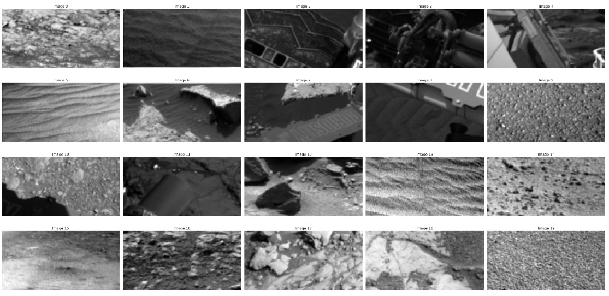
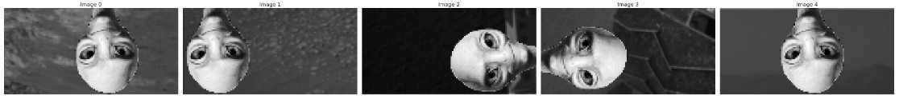
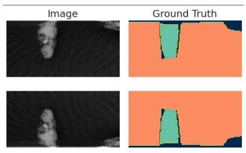
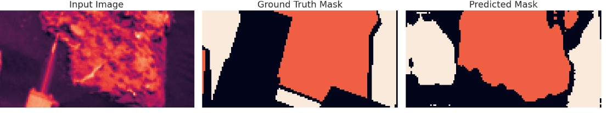
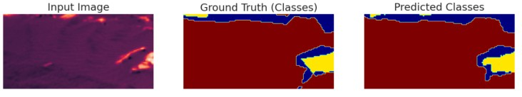

# Semantic Segmentation Mars Terrain Images

* Dataset: Mars Terrain Images 
* Original dataset size: 2,615

  

# Steps Performed :

## Data Inspection: 
Since Dataset had some contaminated images, those images are removed first using basic method such as Similarity search. There were total 106 contaminated images were present.

## Data Augmentation:
To enhance the model’s robustness we performed data augmentation by applying random flips along both the x and y axes. 

## Models Used:

### 1. UNET Segmentation :

For the semantic segmentation task, we employed a modified U-Net architecture, a popular deep learning model designed for pixel-wise predictions.
Overall, the model contains nine levels with convolutional layers, each featuring He initialization and ReLU activation. Dropout is applied at various stages to improve generalization. This U-Net
variant effectively balances computational efficiency and accuracy, ensuring robust segmentation of Mars terrain images.

### 2. GAN Based Segmentation :

For a generative adversarial network (GAN)-based segmentation approach, we employed the Pix2Pix framework, which is well-suited for paired image-toimage translation tasks. In this setup, the network
learns to predict segmentation masks from Mars terrain images by training two core components Generator and Discriminator.

### Result:

By the end of the training (for example, around epoch 189 out of 200), the reported loss values indicate a balanced performance. The discriminator loss (D loss), approximately 1.24, shows that
the discriminator is neither completely fooled nor overly rejecting all generated masks. The generator loss (G loss), about 2.85, combines a very low segmentation loss (Seg loss) of 0.0183—indicating a close match to the ground truth—and an adversarial loss (Adv loss) near 1.02, which ensures sufficient realism.

